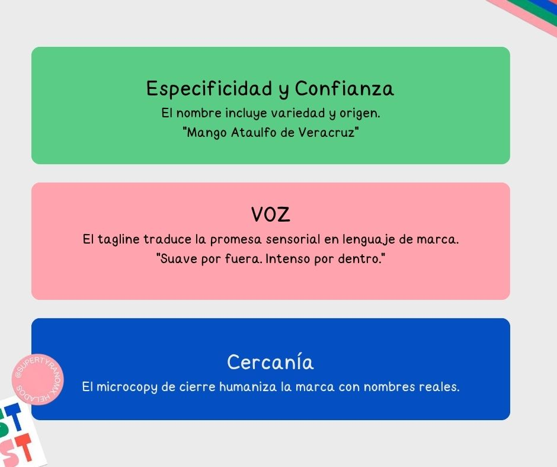

## Super Tyrano: Rediseño de sistema de voz y tono + Auditoría de landing
**Rol:** UX Writer Senior · **Tipo:** Content Strategy, Brand Voice, Landing Optimization

---

### Contexto
Super Tyrano es una heladería artesanal 100% mexicana ubicada en CDMX.
La marca tiene una identidad visual y de contenido muy consolidada en redes, pero esa energía no se reflejaba en su sitio web.

---

### Problema

Se realizó un rediseño de las redes sociales, lo que ocasionó que existía una brecha entre estas y su sitio web.
El sitio web quedó desactualizado, por lo que el nuevo tono se diluía: copy genérico, sin descripción de productos, sin CTA y sin diferenciador de temporada.

---

### Proceso

**Brief de marca**
Releí el documento de identidad con valores, atributos y pilares
de escritura definidos por el equipo fundador: sencillo, cercano
y original, con foco en simplidad, diversión y originalidad.

**Research de marca y canal social**
Analicé las redes sociales de @supertyrano para identificar los recursos
de voz que ya funcionaban en su canal más activo. Los patrones
encontrados fueron:

- **Naming con personalidad propia**
- **Dos modos de escritura que coexisten:** un registro eufórico
  para lanzamientos y uno sensorial y descriptivo para sabores.
- **Voz de recomendación directa:** La marca habla de forma cercana y personal.
- **Contenido de temporada.**
- **Microcopy en producto:** Agregamos descripciones sensoriales, cercanas y específicas.
- **Colaboraciones con marcas afines:** @loreamx, @alelirooftop,
  @donjuliotequila.

**Creación de mockups**
Diseñé mockups del landing con el copy aplicado en contexto, para
validar jerarquía visual y legibilidad de cada decisión de escritura
antes de documentarla.

**Rediseño del sistema de voz y tono**
Traduje los atributos de marca en 3 pilares operativos y una matriz
de tono por contexto, incorporando los recursos de voz que ya existían
en redes pero no estaban sistematizados.

**Reescritura por sección**
Apliqué los principios al landing con justificación documentada por
cada decisión de copy.

---

### Hallazgo clave del research
La voz de Super Tyrano ya era fuerte, pero vivía únicamente en redes.
Traslade y sistematice la voz para que funcionara como guía en redes y en web.

---

### Los dos modos de voz documentados

| Modo | Cuándo usarlo | Características |
|---|---|---|
| Eufórico | Lanzamientos, promos, eventos | Mayúsculas de énfasis, urgencia afectiva, emojis como puntuación |
| Sensorial | Sabores con historia o ingrediente especial | Breve, descriptivo, sin exclamaciones. Deja hablar al producto |

---

### Cambios de copy aplicados al landing

**Hero**
- Antes: `"7 sabores 100% Naturales"`
- Después: `"7 sabores 100% Mexicanos y 100% Naturales"`

**CTA**
- `"Ver sabores de temporada"` — describe el resultado del
  clic y refuerza el concepto de temporalidad.
- Se agregó botón con CTA para visitar, ya que no cuenta con ecommerce.

**Sección de productos — naming**
- Se adoptó el mismo estilo de naming que usan en redes:
  descriptivo, con personalidad y cercano.

**Microcopy de producto**
- `"¿Cuál es tu super poder?"` se incorporó como tagline
  en la sección de productos.

**Sección de origen**
- Titular: `"Conocemos de dónde viene cada ingrediente."`
- Body: `"Trabajamos directo con productores mexicanos."`

**Sección de temporada**
- Se creó una sección que comunica la rotación de sabores de
  temporada como ventaja narrativa, no como limitación.

**Visítanos**
- Antes: `"Visítanos"` + dirección
- Después: `"Encuéntranos en"` + dirección + horarios +
  estado abierto/cerrado

---

### Principios de contenido para el equipo

- **Nombra con personalidad.** El naming es parte de la experiencia.
- **Usa los dos modos con intención.** Eufórico para activar e invitar a la acción.
- **Destaca los diferenciadores:** temporada, origen o promoción.
- **El CTA describe el resultado.**

---

### Matriz de tono por contexto

| Contexto | Estado del usuario | Tono | Ejemplo |
|---|---|---|---|
| Descubrimiento | Curioso, explorando | Cálido + original | "Del campo mexicano a tu cono." |
| Decisión | Evaluando | Específico + confiable | "Bananosaurio: plátano con licor de naranja." |
| Compra | Listo para actuar | Claro + breve | "Ver sabores de temporada" |
| Error / vacío | Frustrado | Empático + orientador | "Tenemos un nuevo sabor ¿Ya lo probaste?" |

---

### Resultado
Un sistema de contenido que sistematizó el tono para hacerlo consistente en sus canales.
Las métricas de éxito propuestas: CTR de CTAs reescritos, tasa de
abandono en error states, y comprehension score en tests de usabilidad.

---
*Metodología: NNGroup — Voice and Tone, Writing for the Web, Microcopy*