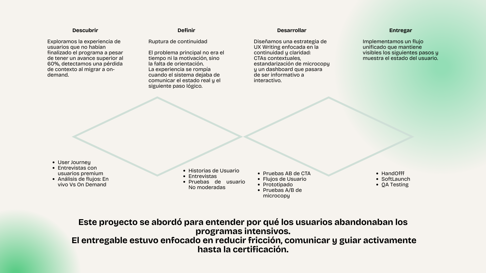
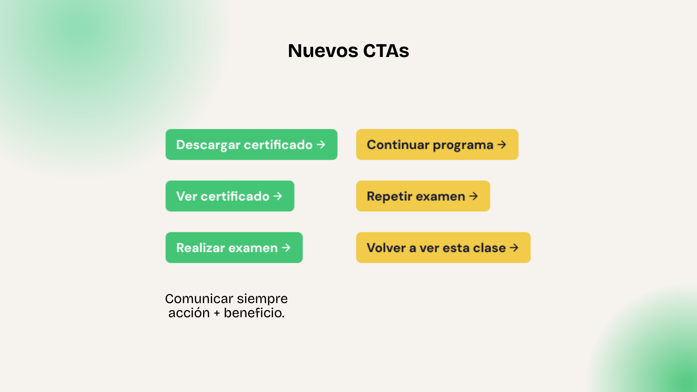
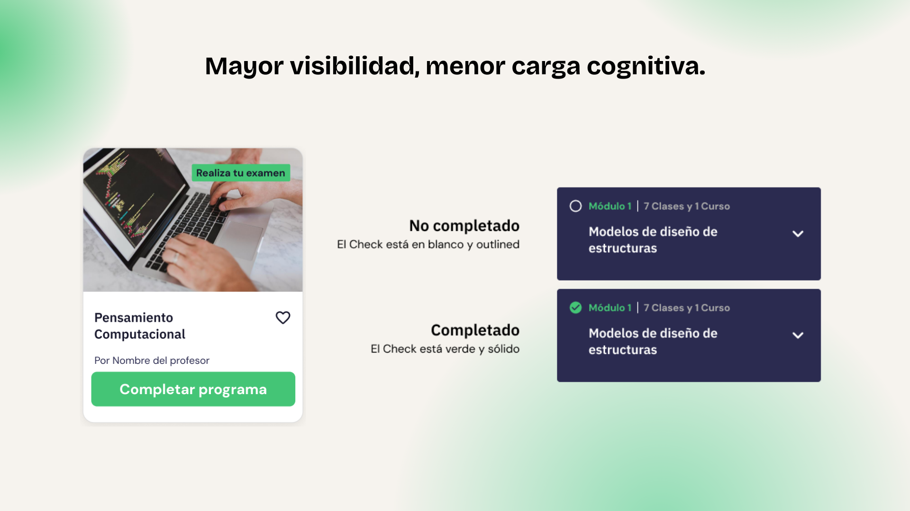
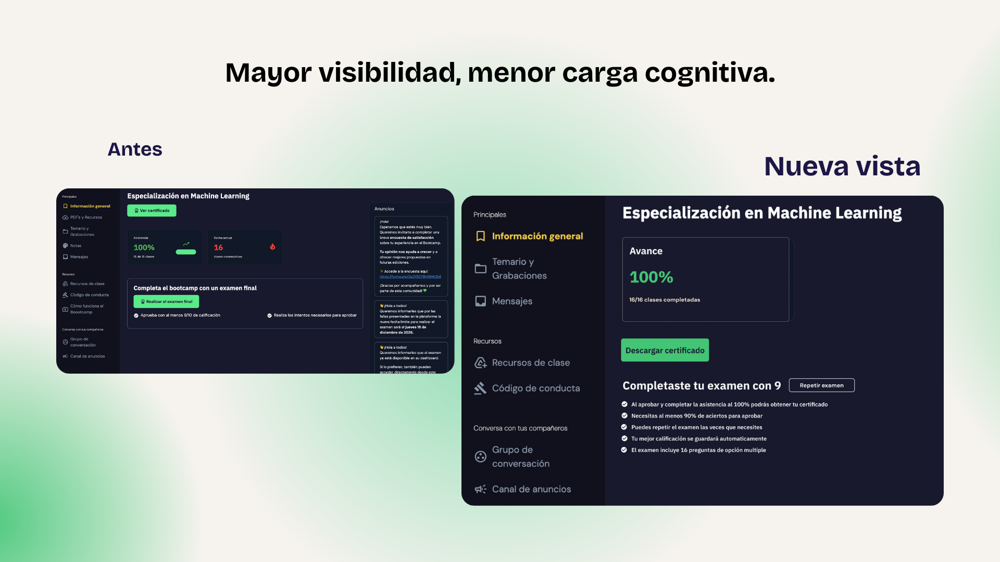
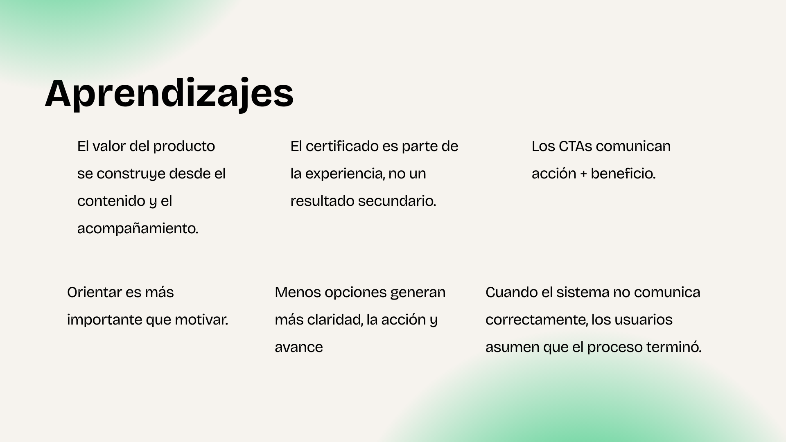

> 🔒 **Nota de confidencialidad**  
> Este proyecto ha sido anonimizado por acuerdos de confidencialidad.  
> Algunos nombres, copys y elementos visuales fueron modificados sin afectar el proceso ni las decisiones de diseño.

# Caso de estudio · UX Writing & Producto

---

**Rol:** *UX Writer & Content Strategist*

**Duración:** *2 meses*

**Industria:** *EdTech · Latinoamérica*

**Usuarios:** *Profesionales activos (25–44) enfocados en upskilling y transición de carrera*

**Objetivo de negocio:** *Incrementar la tasa de finalización de programas intensivos en modalidad on-demand*

---

## Contexto

Plataforma EdTech con programas intensivos que combinan clases en vivo, contenido grabado, examen final y certificación.

Cuando los alumnos no podían asistir a todas las clases en vivo, continuaban el programa en modalidad on-demand.

---

## El problema

La experiencia on-demand no acompañaba la continuidad del aprendizaje.

**Principales fricciones detectadas:**

- El programa dejaba de ser visible aunque existieran acciones pendientes.
- Distintos puntos de entrada generaban experiencias inconsistentes.
- Era difícil identificar clases faltantes, próximos pasos o el acceso al examen.
- El sistema mostraba demasiada información, pero poca orientación.
- CTAs genéricos no impulsaban a completar el examen ni la certificación.

> Resultado: abandono del programa y pérdida de valor percibido de la suscripción premium.
> 

---

## Objetivos

### Experiencia de usuario

- Reducir fricción al retomar el programa en modalidad on-demand.
- Hacer visible el estado real y el progreso del usuario.
- Guiar paso a paso hasta la certificación.

### Negocio

- Reducir la deserción en programas on-demand.
- Incrementar exámenes completados.
- Aumentar certificados generados.
- Reforzar el valor percibido de la suscripción premium.

---

## Investigación

### Métodos utilizados

- Entrevistas con usuarios premium.
- Análisis comparativo de flujos: programa en vivo vs on-demand.
- Evaluación de navegación y arquitectura existente.
- Pruebas A/B de microcopy y CTAs.

### Hallazgos clave

- La experiencia variaba según el punto de acceso.
- Los usuarios no entendían su estado actual ni el siguiente paso.
- El sistema forzaba decisiones innecesarias.
- No existía una señal clara de cierre del proceso.

## Insight principal

> El problema no era el contenido ni la motivación, sino la falta de orientación.
El sistema no acompañaba un proceso que requiere continuidad y cierre explícito.
> 

---

## Decisiones clave de diseño y contenido

### 1. Mantener visible el estado real del usuario

**Problema**

El programa desaparecía de la vista aunque hubiera acciones pendientes, generando confusión y abandono.

**Decisión**

Mantener el programa visible en la sección *Programas activos* hasta completar examen y certificación, reforzando continuidad y claridad durante todo el proceso.

**Microcopy clave**

- Continúa donde te quedaste
- Finaliza tu examen
- Obtén tu certificado

---

### 2. CTAs contextuales alineados al progreso

**Problema**

CTAs genéricos y múltiples opciones generaban carga cognitiva y baja conversión.

**Decisión**

Mostrar un único CTA alineado al siguiente paso lógico según el estado real del usuario.

Eliminar CTAs neutros y comunicar siempre **acción + beneficio**.

**Ejemplos**

- Realiza tu examen
- Repetir examen
- Revisar respuestas
- Repasar esta clase
- Descargar certificado

---

### 3. Unificación del dashboard on-demand

**Problema**

Sobrecarga cognitiva y navegación fragmentada.

**Decisión**

Definir el dashboard como punto único de continuidad, priorizando:

- Estado del programa
- Clases vistas y pendientes claramente identificadas
- Sugerencias relevantes solo para avanzar o cerrar el proceso

**Microcopy**

- Completa el programa
- Repite el examen

---

## Conclusión:

### Este proyecto me reafirmó que el impacto del proyecto no está en generar más contenido, sino en **ayudar a las personas a avanzar**.

Trabajar sobre la experiencia on-demand me permitió entender el impacto de la experiencia de usuario sobre el contenido y la motivación.

---

## *Nota de confidencialidad*

*Caso anonimizado. Flujos y decisiones presentados con fines demostrativos del proceso de UX Writing y estrategia de contenidos.*

---

## Highlights ✨  

⭐️ UX Writing aplicado estratégicamente a producto.  
⭐️ Rediseño de arquitectura de información.  
⭐️ Enfoque en claridad, engagement y conversión.  
⭐️ Caso representativo de transición a **Product Design**.
