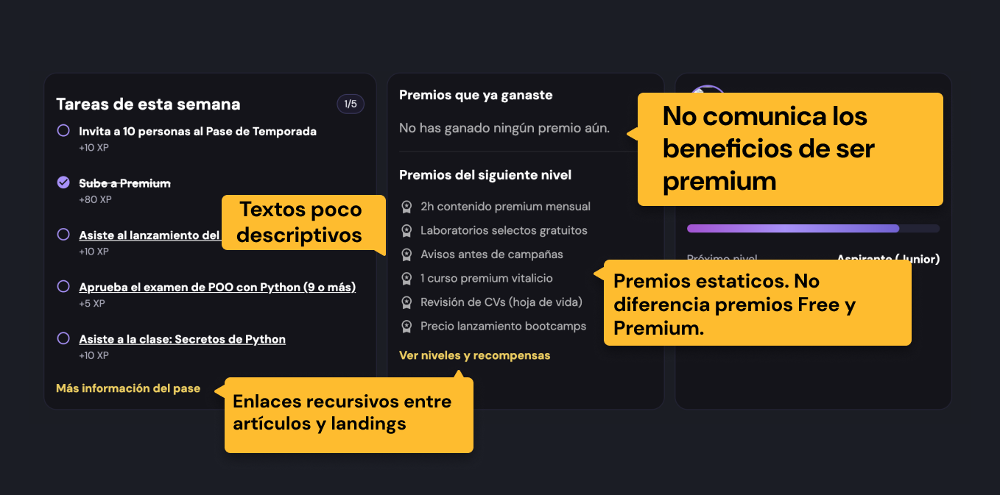
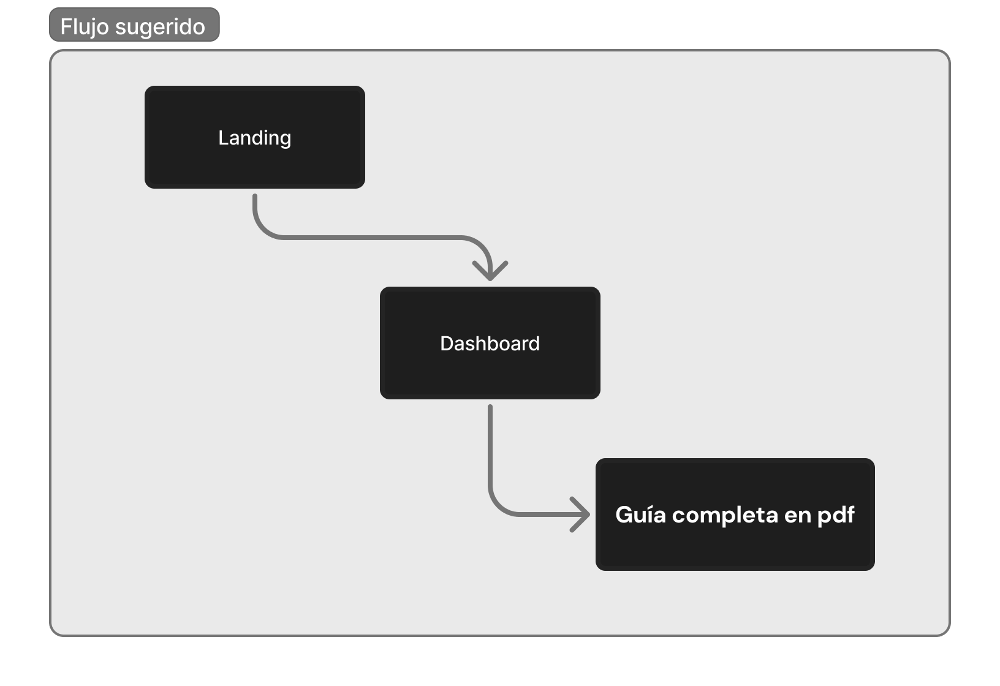
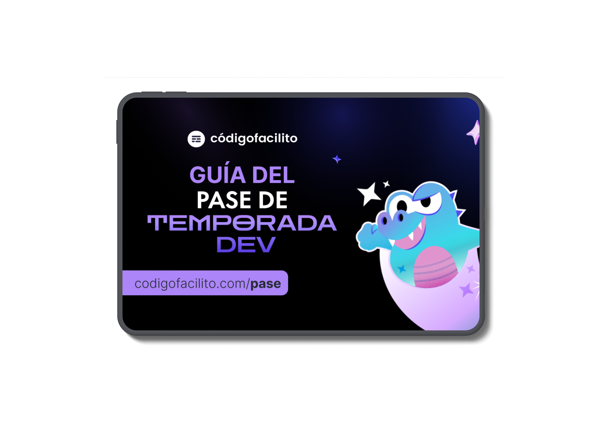

> 🔒 **Nota de confidencialidad**  
> Este proyecto ha sido anonimizado por acuerdos de confidencialidad.  
> Algunos nombres, copys y elementos visuales fueron modificados sin afectar el proceso ni las decisiones de diseño.

# Caso de Estudio: Rediseño de Dashboard Educativo

## Contexto  

La empresa es una **plataforma educativa digital por suscripción**, enfocada en aprendizaje continuo en tecnología y con una base activa de usuarios en LATAM.

El dashboard funciona como el **principal punto de entrada al producto**, y debía comunicar de forma clara:
- Beneficios activos de la suscripción  
- Diferencias entre planes  
- Progreso del usuario  
- Recursos disponibles para aprovechar el producto  

---

## Problema  

### ❌ Falta de claridad y percepción de valor  

- Los usuarios no distinguían claramente entre beneficios gratuitos y de pago.  
- El lenguaje no comunicaba valor ni prioridad.  
- No existía una guía clara para comenzar o continuar dentro del producto.  

Esto generaba **confusión, baja adopción de beneficios y fricción en la experiencia inicial**.

---

### ❌ Navegación fragmentada  

- Enlaces redundantes entre artículos, landings y recursos.  
- Falta de una estructura que explicara cómo funcionaba el producto en conjunto.  

El dashboard funcionaba más como un repositorio que como una guía.

  

---

## Objetivo de diseño  

**Incrementar claridad, reducir fricción y mejorar el engagement**, mediante un rediseño centrado en **UX Writing + Product Design**, alineando lenguaje, jerarquía visual y comportamiento esperado del usuario.

---

## Mi rol  

Participé como **UX Writer en transición a Product Designer**, involucrándome en:

- Análisis del problema desde la experiencia del usuario.  
- Definición de arquitectura de información.  
- Rediseño del layout del dashboard.  
- Reescritura estratégica de copys y CTAs.  
- Definición de impacto esperado y siguientes pasos de medición.

---

## Propuesta de mejora  

### 1. Beneficios dinámicos según tipo de usuario  

- **Antes:** Sección genérica de beneficios que aparecía vacía o confusa para ciertos usuarios.  
- **Después:** “Beneficios actuales”, mostrando solo lo relevante según el tipo de suscripción.  

**Resultado:**  
Los usuarios identifican rápidamente el valor disponible, reduciendo ruido visual y evitando la sensación de “beneficios inflados”.

---

### 2. Recurso centralizado para usuarios pasivos  

- Se incorporó una **guía descargable** que explica el funcionamiento del producto.  
- Accesible desde el dashboard y usable offline.  

**Resultado:**  
Se apoya a usuarios menos activos o que prefieren exploración autónoma, reduciendo abandono temprano.

---

## Impacto esperado  

✨ Mayor claridad → mejor percepción de valor del producto.  
✨ Incremento en engagement → uso más activo de beneficios clave.  
✨ Mejor conversión → comunicación directa de beneficios de planes de pago.  

---

## Reflexión de diseño  

Este proyecto demostró que el problema no era únicamente visual, sino **estructural y de lenguaje**.

- **UX Writing** se utilizó como herramienta de diseño, no como ajuste superficial.  
- La **arquitectura de información** permitió guiar al usuario en lugar de abrumarlo.  
- Se consideraron perfiles activos y pasivos dentro de la misma solución.

### El resultado es un dashboard más claro, accesible y orientado a acción.

---

## Próximos pasos  

- Pruebas A/B para validar cambios en conversión y engagement.  
- Integración de métricas para evaluar adopción de beneficios.  
- Iteraciones basadas en comportamiento real del usuario.

---

## Highlights ✨  

⭐️ UX Writing aplicado estratégicamente a producto.  
⭐️ Rediseño de arquitectura de información.  
⭐️ Enfoque en claridad, engagement y conversión.  
⭐️ Caso representativo de transición a **Product Design**.
