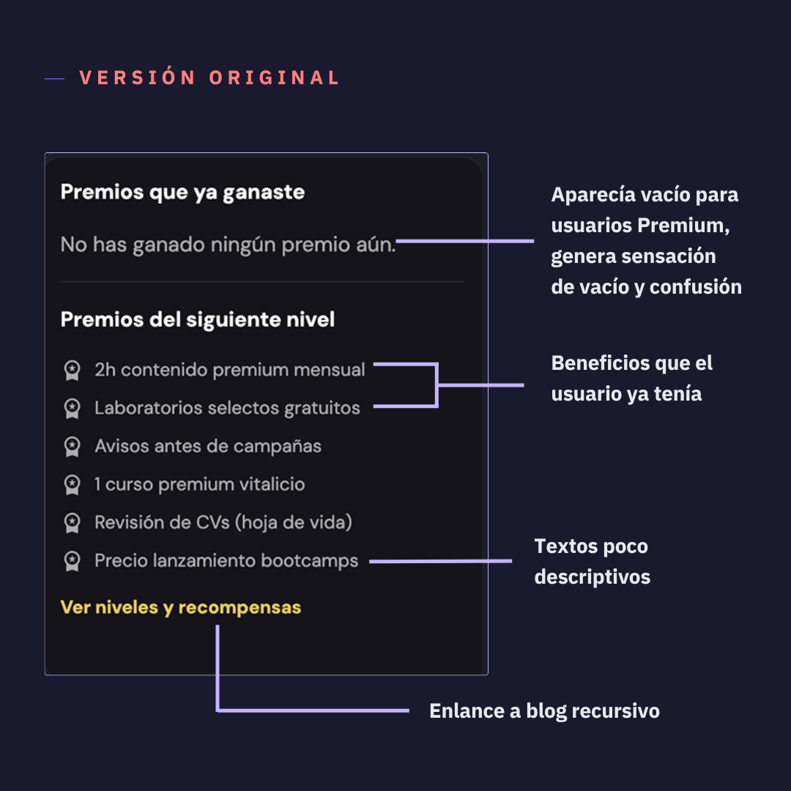
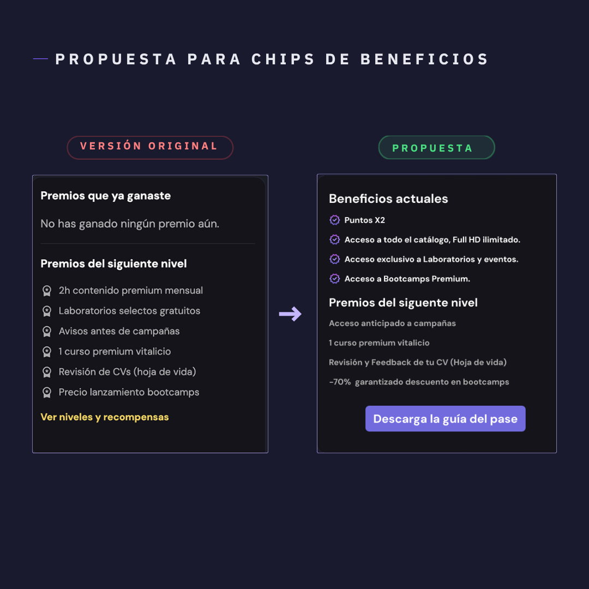
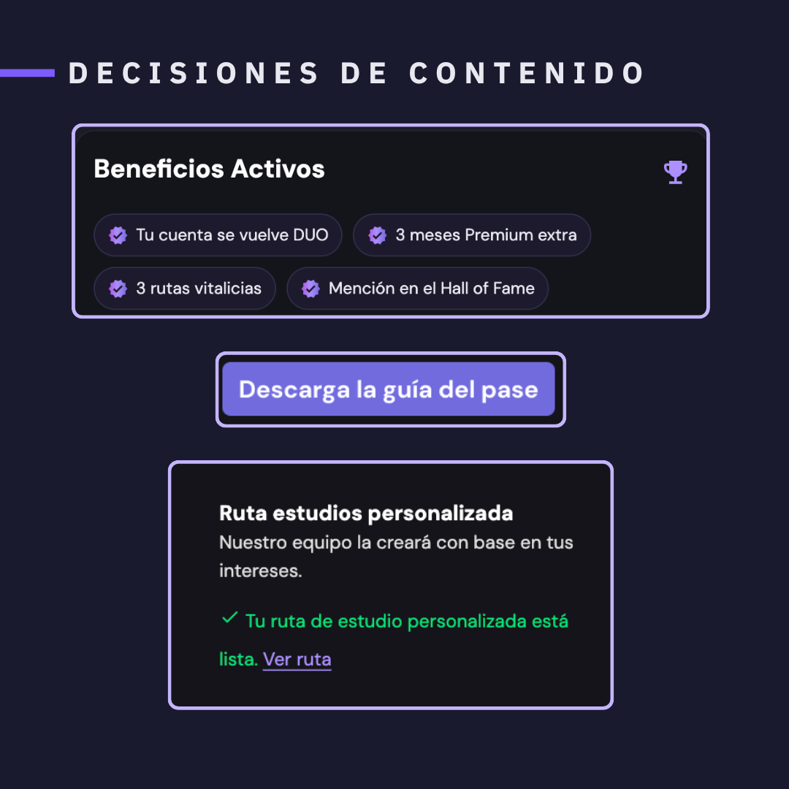
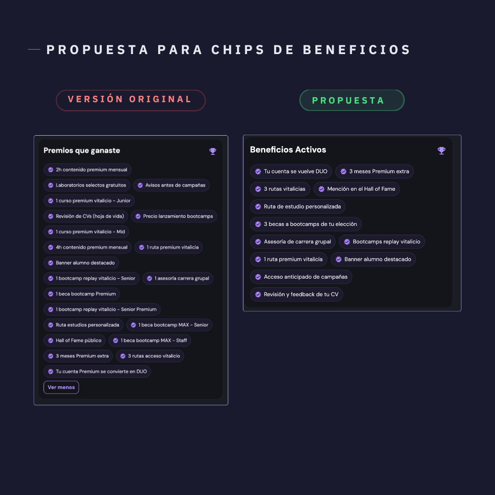
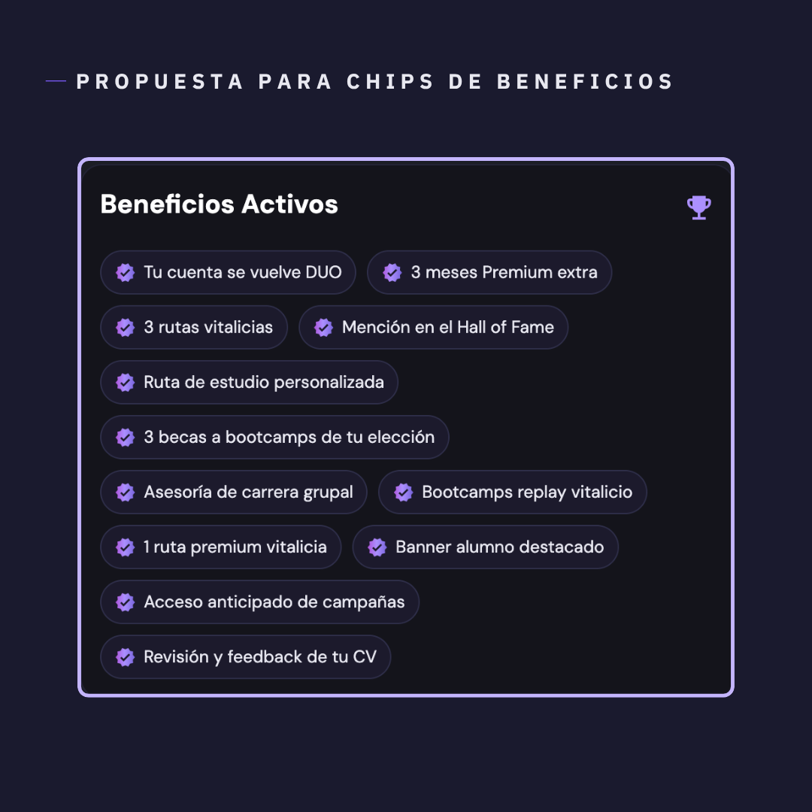
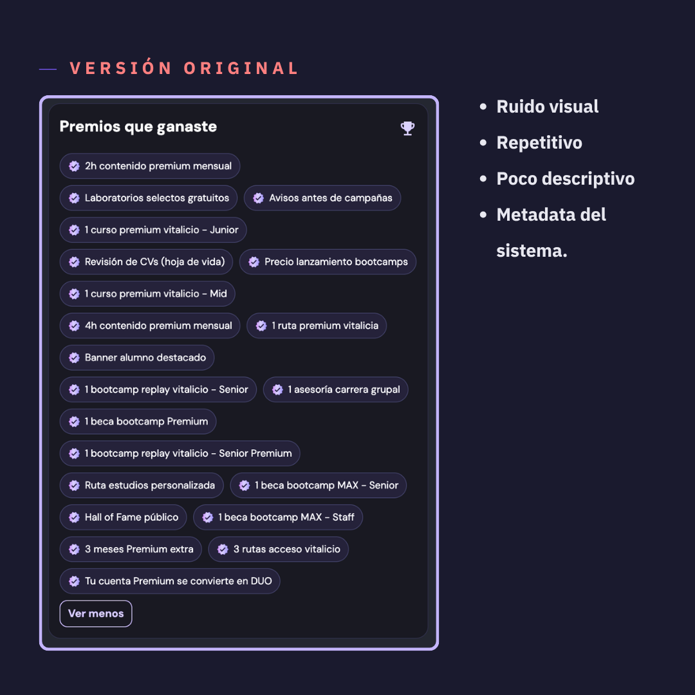
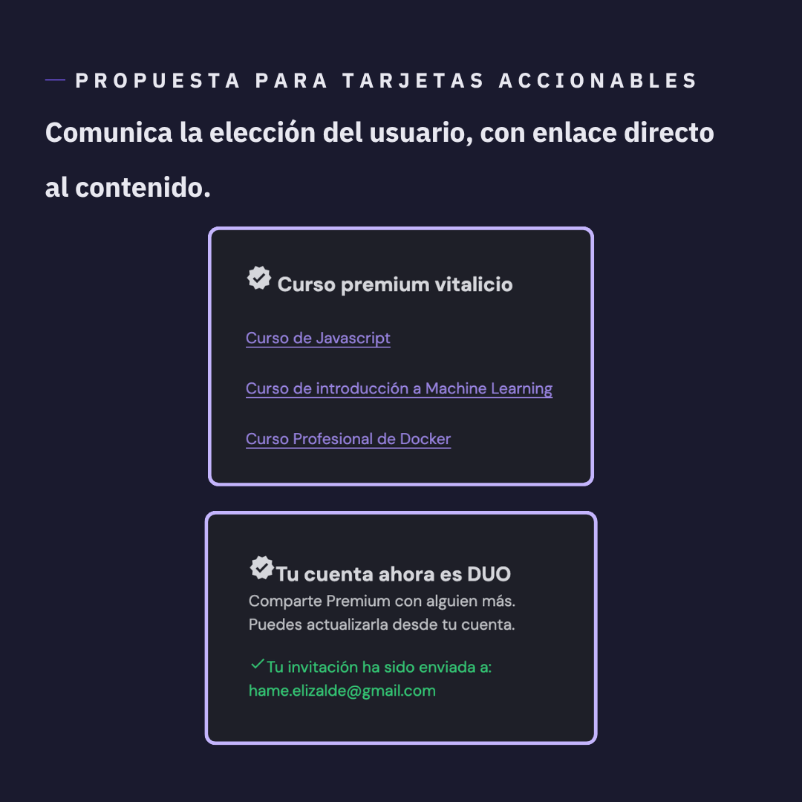
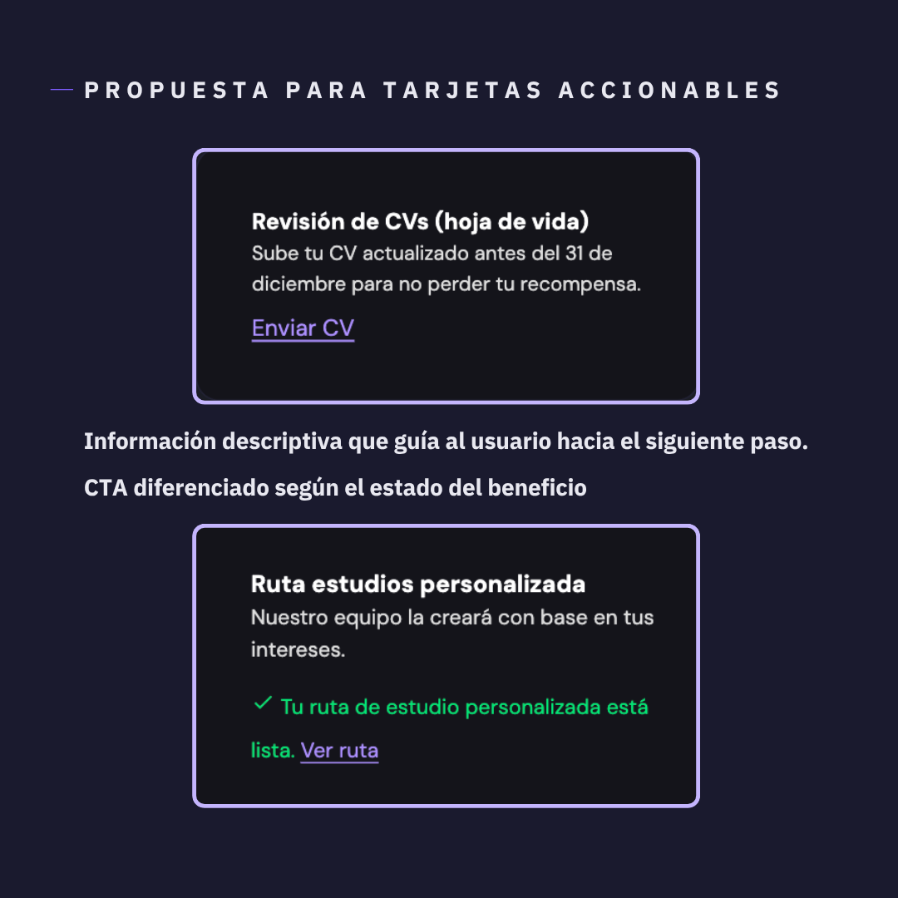
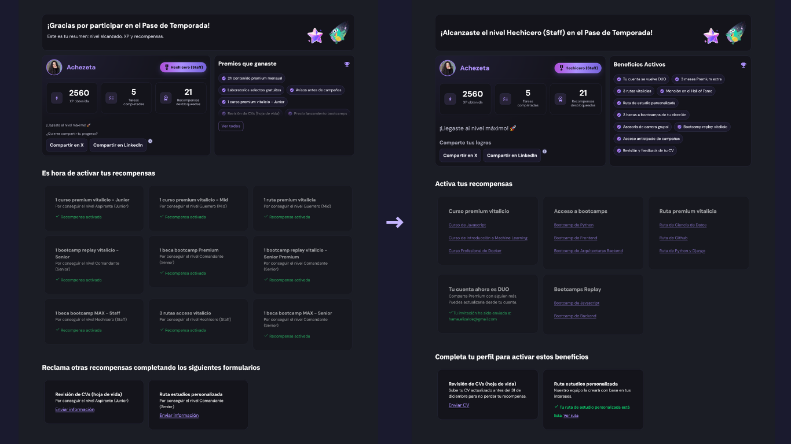

> 🔒 **Nota de confidencialidad**
> Algunos nombres, copys y elementos visuales fueron modificados sin afectar el proceso ni las decisiones de diseño.

# Caso de Estudio: Rediseño de Dashboard Educativo

## Contexto

El **Pase de Temporada Dev** fue una iniciativa de gamificación de una **plataforma educativa digital por suscripción**, enfocada en aprendizaje continuo en tecnología y con una base activa de usuarios en LATAM.

El objetivo era impulsar 4 objetivos simultáneos:

- **Ser el principal punto de entrada al producto**
- **Aumentar la participación de suscriptores activos**
- **Generar conversión de usuarios free a premium**
- **Comunicar nuevos beneficios Premium disponibles, acelerando su adopción**

| | |
|---|---|
| **Producto** | Plataforma de educación en programación para Latinoamérica |
| **Mi rol** | UX Writer · Content Strategist · UX Research Cualitativo · Product Designer |
| **Alcance** | Dashboard + Guía descargable — textos, etiquetas, CTAs y microcopy |
| **Objetivo de negocio** | Aumentar engagement y conversión |

---

## Diagnóstico

En el **QA manual** del flujo end-to-end detecté inconsistencias en el lenguaje y estados vacíos que el sistema no resolvía. Apliqué principios de UX Writing y heurísticas de usabilidad para identificar fricciones y proponer mejoras iterativas, validadas con el equipo.

El **feedback del equipo de soporte** confirmó el problema: los usuarios no comprendían sus beneficios ni cómo redimirlos, evidenciando una brecha en la comunicación de valor.

Como Content Designer, propuse una guía descargable como recurso centralizado para comunicar beneficios, dinámica y sistema de puntos.

### Problemas identificados

**01 · Copy sin diferenciación de audiencia**
- No distinguía entre usuarios Free y Premium.
- "Premios que ya ganaste" aparecía vacío incluso para usuarios con suscripción activa, diluía el valor percibido y generaba frustración.

**02 · Arquitectura de información con fricción**
- Existían enlaces redundantes y recursivos entre artículos y landings. El flujo obligaba a múltiples clics para encontrar información básica sobre el funcionamiento del Pase, generando abandono.

**03 · Usuarios pasivos sin punto de entrada**
- No existía un recurso centralizado para quienes no navegaban el dashboard con frecuencia.

---

## Propuesta de copy

El cambio más impactante fue reencuadrar el lenguaje: *lo que ya tienes* y *lo que puedes obtener*. Hablar desde la realidad del usuario.

| Premios que ya ganaste | Beneficios activos |
|---|---|
| Aparecía vacío, incluso para usuarios Premium | Muestra de los beneficios de la suscripción |
| Sin diferenciación y genérico | Contenido dinámico por tipo de suscripción |
| CTA que enviaba a artículo recursivo | Botón "Descarga la guía del pase", recurso centralizado |

**¿Por qué Beneficios?**
Para una campaña de adopción y conversión, mostrar los beneficios de la suscripción es más poderoso que mostrar lo que el usuario no ha ganado.

---

## Decisiones de contenido

Cada modificación respondió a los objetivos definidos.

**Contenido dinámico**
El copy se adapta al tipo de usuario (Freemium / Premium). Mostrar valor relevante de inmediato elimina la experiencia genérica.
`Personalización` `Inmediatez`

**Eliminación de fricción navegacional**
Consolidar la información en un recurso único: la Guía del Pase Ebook. Evitar loops entre páginas y artículos.
`Claridad` `Jerarquía`

**CTAs relevantes**
Botón "Descarga la guía del pase" como onboarding pasivo. CTA con lenguaje concreto y orientado a la acción.
`Retención` `Inclusión`

**Copy orientado a conversión**
Lenguaje concreto para hacer tangibles los beneficios de subir de nivel. Diferenciar los beneficios de usuarios Free vs Premium para promover la conversión.
`Conversión` `Honestidad`

---

## Chips de beneficios obtenidos

## Sugerencia

- **Consolidación:** Beneficios similares se agruparon.
- **Contenido personalizado:** El sistema muestra únicamente lo que aplica al nivel real.
- **Jerarquía de valor:** Los beneficios más exclusivos aparecen primero, reforzando el logro.
- **Lenguaje desde el usuario:** Cada beneficio describe lo que el usuario puede hacer, no cómo se llama la funcionalidad.

## Antes

- **Exceso de elementos:** Texto repetitivo y poco descriptivo.
- **Desconfianza:** Beneficios que ya eran del usuario aparecían como no ganados.
- **Lenguaje lejano:** Se mostraba metadata del sistema, no acciones del usuario.

---

## Tarjetas accionables

## Sugerencia

- **Consolidación:** Una sola tarjeta con multiselect, eliminando el bug de duplicados.
- **Tarjetas accionables:** Cada tarjeta muestra la elección con enlace directo.

## Antes

- **Ruido y redundancia:** Cada beneficio obtenido, aunque fuera del mismo tipo, tenía su propia tarjeta.
- **Tarjetas sin destino:** Eran meramente informativas. El usuario contactaba a soporte para saber qué curso había elegido.
- **Bug de selección:** Cada tarjeta tenía un selector individual, lo que permitía elegir el mismo curso varias veces.

---

## Tarjetas de beneficios pendientes

## Sugerencia

- **Contexto, descripción y acción:** Información descriptiva que guía al usuario hacia el siguiente paso.
- **Estado visible:** CTA según el estado del beneficio.

## Antes

- **Tarjetas sin contexto de acción:** El subtexto *"Por conseguir el nivel Aspirante (Junior)"* es metadata del sistema, no una guía de acción.
- **CTA genérico:** *"Enviar información"* no describe qué, para qué, ni qué pasa después.

---

## Impacto: El copy como decisión de producto.

| Resultado | Impacto |
|---|---|
| **– 47% Menos ruido** | De 21 a 11 beneficios. |
| **0 bugs de selección duplicada** | El multiselect por tarjeta eliminó un error que el sistema anterior no prevenía. |
| **0 consultas a soporte sobre elecciones** | Las tarjetas accionables con enlaces directos reemplazaron una de las dudas más frecuentes reportadas. |

**Percepción**
Mostrar lo que el usuario ya tiene aumenta el valor percibido desde la primera pantalla.

**Conversión**
El usuario Free ve los beneficios de la cuenta Premium.

**Retención**
La guía Ebook concentró en un recurso todo lo que antes requería navegar múltiples pantallas.

**UX Writing como sistema**
Etiquetas, CTAs y estados con tono consistente y jerarquía clara.

**Arquitectura de información**
Menos clicks, menos bucles, menos fricción.

---

## Próximos pasos

El Pase de Temporada se planea como un evento anual. Los cambios de copy y arquitectura de información sientan la base para la siguiente edición: un sistema que ya sabe hablarle a cada tipo de usuario y que puede medirse con métricas claras.

- Pruebas de comprensión con usuarios
- Pruebas A/B en copy de beneficios
- Medición de adopción del botón de descarga
- Análisis de clics en CTAs de activación
- Medición de churn rate
- Entrevistas de comprensión y adopción post-lanzamiento

---

**Herramientas utilizadas**
Figma · Análisis heurístico · Feedback cualitativo de usuarios y soporte · UX Writing · Content Strategy

